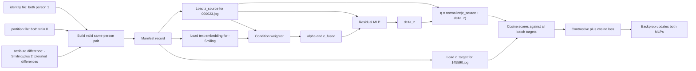

# Practical Full Training Cycle

Status: concrete worked example verified against the local CelebA metadata on June 11, 2026.

This document follows one real same-person pair from the original `.txt` files through pair construction, cached CLIP embeddings, the condition-weight MLP, the residual MLP, cosine similarity, loss, and backpropagation.

Important distinction:

- filenames, person ID, split, and attribute values below are real and verified;
- tensor dimensions follow the proposed architecture;
- shortened embedding values, MLP outputs, similarities, and loss values are illustrative because the learned model has not been implemented or trained yet.

## 1. The Real Raw Records

We use these two real CelebA images:

```text
source image: 000023.jpg
target image: 145590.jpg
```

### Identity file

From `celeba/identity_CelebA.txt`:

```text
000023.jpg 1
145590.jpg 1
```

Therefore both images belong to person ID `1`.

The person ID is used to find candidate training pairs. It is not passed to either MLP and it is not the final retrieval label.

### Partition file

From `celeba/list_eval_partition.txt`:

```text
000023.jpg 0
145590.jpg 0
```

`0` means train, so this pair can be used for training without crossing split boundaries.

### Attribute file

The relevant values from `celeba/list_attr_celeba.txt` are:

| Image | Big_Nose | Narrow_Eyes | Smiling | Eyeglasses | Young | Male | Heavy_Makeup |
| --- | ---: | ---: | ---: | ---: | ---: | ---: | ---: |
| `000023.jpg` | `+1` | `+1` | `+1` | `-1` | `+1` | `+1` | `-1` |
| `145590.jpg` | `-1` | `-1` | `-1` | `-1` | `+1` | `+1` | `-1` |

Interpretation of the five most intuitive displayed characteristics:

```text
000023.jpg:
  Smiling       = yes
  Eyeglasses    = no
  Young         = yes
  Male          = yes
  Heavy_Makeup  = no

145590.jpg:
  Smiling       = no
  Eyeglasses    = no
  Young         = yes
  Male          = yes
  Heavy_Makeup  = no
```

## 2. Find The Attribute Difference

For each of the 40 attributes, compare source and target:

```python
different_attributes = {
    name
    for name in attribute_names
    if source_attributes[name] != target_attributes[name]
}
```

For this real pair:

```text
D = {Big_Nose, Narrow_Eyes, Smiling}
```

The directional changes from source to target are:

```text
Big_Nose:    +1 -> -1  therefore -Big_Nose
Narrow_Eyes: +1 -> -1  therefore -Narrow_Eyes
Smiling:     +1 -> -1  therefore -Smiling
```

For a simple single-condition training example, choose:

```text
explicit query Q = {-Smiling}
```

The target also differs in two characteristics that were not explicitly requested:

```text
D \ Q = {Big_Nose, Narrow_Eyes}
non_query_hamming = 2
```

This pair passes the proposed relaxed rule `|D \ Q| <= 2`. It asks the model to learn the important edit while tolerating a small amount of real-world variation.

## 3. Generated Manifest Record

The pair builder converts the raw metadata into one lightweight training record:

```json
{
  "pair_id": "train_person_1_000023_to_145590",
  "source_filename": "000023.jpg",
  "target_filename": "145590.jpg",
  "source_person_id": 1,
  "target_person_id": 1,
  "pair_type": "same_identity",
  "conditions": [
    {
      "attribute": "Smiling",
      "sign": -1,
      "prompt": "a face that is not smiling"
    }
  ],
  "non_query_differences": ["Big_Nose", "Narrow_Eyes"],
  "non_query_hamming": 2,
  "split": "train"
}
```

The images and original `.txt` files are not copied or modified. The manifest only stores references.

## 4. Dataset Lookup And One Batch Item

Because CLIP is frozen, embeddings should be cached before training:

```python
z_source = image_cache["000023.jpg"]
z_target = image_cache["145590.jpg"]
c_smiling = text_cache["-Smiling"]
```

With `openai/clip-vit-base-patch32`, each projected embedding has 512 components:

```text
z_source.shape  = [512]
z_target.shape  = [512]
c_smiling.shape = [512]
```

A shortened illustration might look like this:

```text
z_source  = [ 0.031, -0.018,  0.044, ...,  0.012]  # illustrative
z_target  = [ 0.027, -0.006,  0.039, ..., -0.003]  # illustrative
c_smiling = [-0.052,  0.021, -0.014, ...,  0.033]  # illustrative
sign      = -1
mask      = 1
```

The dataset returns:

```python
item = {
    "source_embedding": z_source,       # model input
    "condition_embeddings": [c_smiling],# model input
    "condition_signs": [-1],            # model input
    "condition_mask": [True],            # model input
    "target_embedding": z_target,       # supervision target
    "source_filename": "000023.jpg",   # tracing/debugging
    "target_filename": "145590.jpg",   # tracing/debugging
}
```

The person ID and 40 attributes have already done their job: they constructed and validated the pair. They normally do not enter the composition model.

## 5. First MLP: Condition Weighter

The condition weighter decides how strongly each requested condition should influence this particular source image.

For one condition:

```text
gate input = concatenate(z_source, c_smiling, sign)
shape      = 512 + 512 + 1 = 1025
```

Conceptual computation:

```python
gate_input = torch.cat([z_source, c_smiling, tensor([-1.0])])
raw_weight = condition_weighter(gate_input)
alpha = torch.sigmoid(raw_weight)
c_fused = alpha * c_smiling
```

Illustrative output:

```text
raw_weight = 0.53
alpha      = sigmoid(0.53) = 0.63
c_fused    = 0.63 * c_smiling
```

There is no label saying that the correct weight must be `0.63`. The weight MLP learns indirectly: a useful weight helps the final query retrieve the target and lowers the final loss.

The negative edit is already represented by the prompt `"a face that is not smiling"`. The sign is supplied as context to the gate; the prompt embedding must not also be multiplied by `-1` unless testing a separate vector-arithmetic baseline.

With several conditions, the same gate runs for every condition and the weighted vectors are aggregated:

```text
alpha_1 = gate(z_source, c_1, sign_1)
alpha_2 = gate(z_source, c_2, sign_2)
c_fused = weighted_mean(alpha_1*c_1, alpha_2*c_2, ...)
```

## 6. Second MLP: Residual Predictor

The residual MLP receives the source embedding and the fused edit:

```text
residual input = concatenate(z_source, c_fused)
shape          = 512 + 512 = 1024
```

It predicts a movement in CLIP space:

```python
residual_input = torch.cat([z_source, c_fused])
delta_z = residual_mlp(residual_input)       # shape [512]
q = F.normalize(z_source + delta_z, dim=-1) # shape [512]
```

Illustrative shortened values:

```text
delta_z = [-0.004, 0.011, -0.006, ..., -0.002]
q       = [ 0.028,-0.007,  0.039, ...,  0.005]
```

`q` is not a generated face. It is the predicted retrieval embedding: where the source face should move in CLIP space after applying `-Smiling`.

### Data versus target in the residual stage

```text
DATA / INPUT:
  z_source
  c_fused, produced by the weight MLP

NETWORK OUTPUT:
  delta_z
  q = normalize(z_source + delta_z)

TARGET / LABEL:
  z_target, the frozen CLIP embedding of 145590.jpg
```

The residual MLP never receives `z_target` as input. `z_target` is only used after prediction to calculate the loss.

## 7. Cosine Similarity And Contrastive Loss

For the positive pair:

```python
positive_similarity = F.cosine_similarity(q, z_target, dim=-1)
```

An illustrative result might be:

```text
cosine(q, z_target) = 0.81
cosine loss         = 1 - 0.81 = 0.19
```

Training should not compare only this one positive pair. In a batch of `B` examples, compare every predicted query with every target:

```python
logits = q_batch @ z_target_batch.T / temperature  # [B, B]
labels = torch.arange(B)                           # [0, 1, ..., B-1]
contrastive_loss = F.cross_entropy(logits, labels)
```

Illustrative batch with four examples:

```text
                         TARGET COLUMN
                 pair 0  pair 1  pair 2  pair 3
QUERY pair 0       8.2     2.1     1.4     0.8   <- correct column is 0
QUERY pair 1       1.7     7.6     2.2     1.1   <- correct column is 1
QUERY pair 2       0.9     1.8     6.9     2.0   <- correct column is 2
QUERY pair 3       1.2     0.7     1.6     7.9   <- correct column is 3
```

The desired target is the diagonal because row `i` and column `i` came from the same manifest record.

Combined objective:

```python
loss = contrastive_loss + cosine_loss_weight * cosine_loss
```

## 8. Backpropagation: Which Parameters Change?

```python
optimizer.zero_grad()
loss.backward()
optimizer.step()
```

The gradient path is:

```text
loss
 -> q
 -> delta_z
 -> residual MLP parameters theta_r
 -> c_fused
 -> alpha
 -> condition-weight MLP parameters theta_w
```

Updated:

```text
condition weighter theta_w
residual MLP theta_r
```

Not updated:

```text
frozen CLIP image encoder
frozen CLIP text encoder
cached source, target, and prompt embeddings
raw CelebA files
```

## 9. The Complete Cycle In One View



One epoch repeats this cycle for every batch in the training loader. Validation then runs the same forward path on partition `1`, without `backward()` or `optimizer.step()`.

## 10. What Changes At Inference Time?

At inference, there is no target image supplied to the model:

```text
INPUT:
  source image 000023.jpg
  textual request -Smiling

MODEL:
  source CLIP embedding
  -> condition weighter
  -> residual MLP
  -> predicted query q

RETRIEVAL OUTPUT:
  rank every test-gallery embedding by cosine(q, gallery_embedding)
  return top-K image indices and scores
```

The hidden target is used only by the evaluator after ranking. Official correctness is determined by whether the returned test indices occur in the acceptable target list from `celeba_evaluation.json`, measured with Recall@1/5/10 and Precision@1/5/10.

## 11. Minimal PyTorch Skeleton

```python
for batch in train_loader:
    z_source = batch["source_embedding"]
    condition_embeddings = batch["condition_embeddings"]
    condition_signs = batch["condition_signs"]
    condition_mask = batch["condition_mask"]
    z_target = batch["target_embedding"]

    q, alpha, delta_z = model(
        z_source,
        condition_embeddings,
        condition_signs,
        condition_mask,
    )

    logits = q @ z_target.T / temperature
    labels = torch.arange(q.shape[0], device=q.device)

    loss_contrastive = F.cross_entropy(logits, labels)
    loss_cosine = (1 - (q * z_target).sum(dim=-1)).mean()
    loss = loss_contrastive + cosine_loss_weight * loss_cosine

    optimizer.zero_grad()
    loss.backward()
    optimizer.step()
```

In one sentence: metadata creates the training question, frozen CLIP converts images and text into vectors, the first MLP decides how much each condition matters, the second MLP predicts how to move the source vector, and cosine-based retrieval loss teaches both MLPs where that movement should end.
