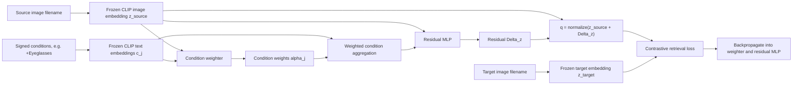
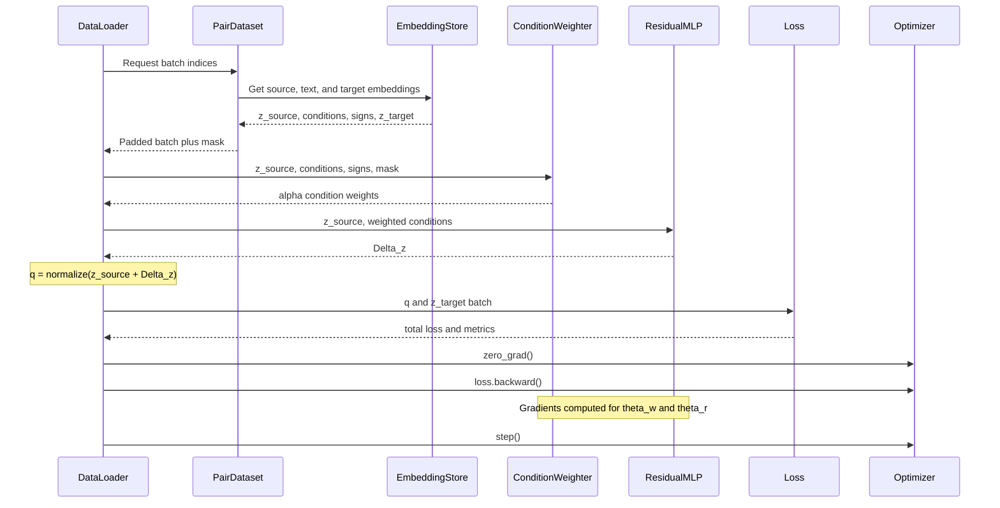
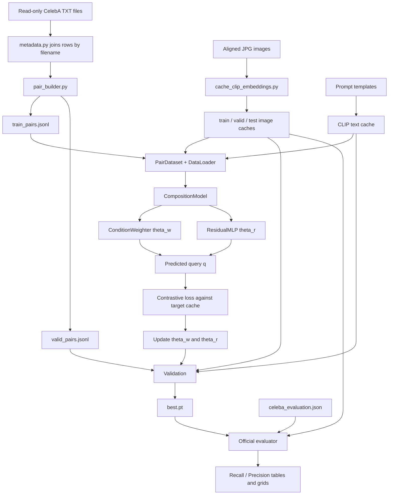

# Project Folder And Training Flow Schema

Status: proposed implementation structure, June 11, 2026.

This document translates the project design into a concrete folder tree and an end-to-end training flow. It shows:

- where raw data, labels, generated pairs, cached embeddings, model code, checkpoints, and results belong;
- what each important file contains;
- what enters the condition-weight network and residual MLP;
- what the training label really is;
- what happens during each batch and epoch.

It does not move or modify the original CelebA `.txt` files. Those remain read-only source data.

For a single real pair followed numerically and structurally through every stage, see [PRACTICAL_TRAINING_CYCLE.md](PRACTICAL_TRAINING_CYCLE.md).

## 1. Core Idea In One Diagram



CLIP remains frozen. Only these two parts receive gradient updates:

```text
condition weighter parameters: theta_w
residual MLP parameters:       theta_r
```

Both are owned by one `CompositionModel` and optimized jointly.

## 2. Current Files Versus Proposed Structure

Legend:

```text
[EXISTS]     already present
[CREATE]     source code or configuration to implement
[GENERATED]  produced by preprocessing, training, or evaluation
[LOCAL]      large/private local data; do not commit
```

```text
deep_learning/
|
|-- README.md                                      [EXISTS]
|   `-- Project title, authors, documentation links
|
|-- PROJECT_STATE_AND_SOLUTION.md                  [EXISTS]
|   `-- Current project status and selected solution
|
|-- PROJECT_GUIDE.md                               [EXISTS]
|   `-- Complete project explanation and implementation guide
|
|-- PROJECT_FOLDER_AND_TRAINING_SCHEMA.md          [EXISTS: this file]
|   `-- Folder tree, file schemas, and training call flow
|
|-- PRACTICAL_TRAINING_CYCLE.md                    [EXISTS]
|   `-- Real pair from metadata through both MLPs, loss, and inference
|
|-- Project Skeleton.ipynb                         [EXISTS]
|   `-- Instructor starter: data loading and metric examples
|
|-- celeba_evaluation.json                         [EXISTS]
|   `-- Official test query -> source index -> valid targets
|
|-- celeba/                                        [EXISTS, LOCAL, READ-ONLY]
|   |-- img_align_celeba/
|   |   |-- 000001.jpg
|   |   |-- 000002.jpg
|   |   `-- ... 202599.jpg
|   |-- identity_CelebA.txt
|   |-- list_attr_celeba.txt
|   |-- list_eval_partition.txt
|   |-- list_bbox_celeba.txt
|   |-- list_landmarks_align_celeba.txt
|   `-- list_landmarks_celeba.txt
|
|-- data/
|   `-- celeba/
|       |-- annotations/                            [EXISTS, COMMITTED]
|       |   |-- identity_CelebA.txt
|       |   |-- list_attr_celeba.txt
|       |   |-- list_eval_partition.txt
|       |   |-- list_bbox_celeba.txt
|       |   |-- list_landmarks_align_celeba.txt
|       |   `-- list_landmarks_celeba.txt
|       `-- images/
|           `-- .gitkeep                            [EXISTS; images not committed]
|
|-- configs/                                       [CREATE]
|   |-- baseline.yaml
|   `-- residual_gated.yaml
|
|-- src/                                           [CREATE]
|   `-- compositional_retrieval/
|       |-- __init__.py
|       |-- config.py
|       |-- data/
|       |   |-- metadata.py
|       |   |-- pair_builder.py
|       |   |-- pair_dataset.py
|       |   `-- collate.py
|       |-- features/
|       |   |-- clip_encoder.py
|       |   |-- embedding_store.py
|       |   `-- prompts.py
|       |-- models/
|       |   |-- condition_weighter.py
|       |   |-- residual_mlp.py
|       |   `-- composition_model.py
|       |-- training/
|       |   |-- losses.py
|       |   |-- trainer.py
|       |   `-- checkpointing.py
|       |-- retrieval/
|       |   |-- ranker.py
|       |   `-- evaluator.py
|       `-- visualization/
|           `-- retrieval_grid.py
|
|-- scripts/                                       [EXISTS + CREATE]
|   |-- count_identity_pairs.py                     [EXISTS]
|   |-- build_pair_manifests.py                     [CREATE]
|   |-- cache_clip_embeddings.py                    [CREATE]
|   |-- train.py                                    [CREATE]
|   `-- evaluate.py                                 [CREATE]
|
|-- artifacts/                                     [GENERATED, IGNORE IN GIT]
|   |-- manifests/
|   |   |-- train_pairs.jsonl
|   |   |-- valid_pairs.jsonl
|   |   `-- manifest_stats.json
|   |-- embeddings/
|   |   |-- clip_train.pt
|   |   |-- clip_valid.pt
|   |   |-- clip_test.pt
|   |   |-- clip_text_prompts.pt
|   |   `-- embedding_metadata.json
|   |-- checkpoints/
|   |   |-- best.pt
|   |   `-- last.pt
|   |-- logs/
|   |   |-- training.csv
|   |   `-- config_snapshot.yaml
|   `-- results/
|       |-- baseline_metrics.csv
|       |-- proposed_metrics.csv
|       |-- per_query_metrics.csv
|       `-- qualitative/
|           `-- query_00_source_13.png
|
|-- notebooks/                                     [CREATE]
|   |-- 01_data_exploration.ipynb
|   |-- 02_baseline.ipynb
|   |-- 03_training_analysis.ipynb
|   `-- final_submission.ipynb
|
|-- tests/                                         [CREATE]
|   |-- test_metadata.py
|   |-- test_pair_builder.py
|   |-- test_model_shapes.py
|   |-- test_losses.py
|   `-- test_evaluator.py
|
|-- ground_truth_dashboard/                        [EXISTS]
|   `-- Visual inspection of official JSON ground truth
|
`-- llm-wiki/                                      [EXISTS, LOCAL-ONLY]
    `-- Persistent local project knowledge
```

## 3. Raw Dataset Files And Their Structures

The original files under `celeba/` are inputs. Training code must only read them.

### `celeba/img_align_celeba/<filename>.jpg`

Example:

```text
celeba/img_align_celeba/000001.jpg
```

Contains:

```text
one aligned RGB face image
```

Used for:

- CLIP image preprocessing;
- source and target image embeddings;
- test gallery embeddings;
- qualitative result images.

### `celeba/identity_CelebA.txt`

Example rows:

```text
000001.jpg 2880
000002.jpg 2937
000003.jpg 8692
```

Schema:

```text
image_filename person_id
```

Used for:

- grouping images of the same person;
- creating preservation-focused source/target pairs.

Not used as the official test label.

### `celeba/list_attr_celeba.txt`

Example:

```text
202599
5_o_Clock_Shadow Arched_Eyebrows ... Smiling ... Young
000001.jpg -1 1 1 ... 1 ... 1
```

Schema:

```text
line 1: total image count
line 2: 40 attribute names
other lines: image_filename + 40 values in {-1, +1}
```

Used for:

- deriving which attributes change between source and target;
- creating conditions such as `+Smiling` and `-Eyeglasses`;
- filtering pairs by non-query Hamming distance;
- constructing benchmark-style pairs.

### `celeba/list_eval_partition.txt`

Example:

```text
000001.jpg 0
000002.jpg 0
```

Schema:

```text
image_filename split_id
```

Values:

```text
0 = train
1 = validation
2 = test
```

Used for preventing leakage. Pair creation must never cross split boundaries.

### Bounding Boxes And Landmarks

```text
list_bbox_celeba.txt:
image_filename x y width height

list_landmarks_align_celeba.txt:
image_filename left_eye_xy right_eye_xy nose_xy mouth_left_xy mouth_right_xy

list_landmarks_celeba.txt:
same five points in original-image coordinates
```

These are optional for pose/crop/pair-quality experiments. They are not required for the first CLIP model.

### `celeba_evaluation.json`

Example:

```json
{
  "query": "+Smiling",
  "ground_truth": {
    "13": [325, 456, 579, 685]
  }
}
```

Schema:

```text
query
  -> source index inside CelebA test split
      -> acceptable target indices inside CelebA test split
```

Used only for official test evaluation and dashboard inspection, never for training.

## 4. Joined Metadata Table

`metadata.py` should read the original `.txt` files and create an in-memory record for each image without changing the sources.

Conceptual joined row:

```python
ImageRecord(
    filename="000001.jpg",
    person_id=2880,
    split="train",
    attributes={
        "Smiling": 1,
        "Eyeglasses": -1,
        "Young": 1,
    },
    image_path="celeba/img_align_celeba/000001.jpg",
)
```

Join key:

```text
image filename
```

Do not join on person ID or filename number converted to integer.

## 5. Generated Pair Manifest: The Training Dataset Index

`build_pair_manifests.py` reads the joined metadata and writes lightweight references. It does not copy image pixels.

### `artifacts/manifests/train_pairs.jsonl`

One JSON object per training direction:

```json
{
  "pair_id": "train_00000001",
  "source_filename": "000101.jpg",
  "target_filename": "000245.jpg",
  "source_person_id": 42,
  "target_person_id": 42,
  "pair_type": "same_identity",
  "conditions": [
    {"attribute": "Eyeglasses", "sign": 1},
    {"attribute": "Smiling", "sign": 1}
  ],
  "non_query_differences": ["High_Cheekbones"],
  "non_query_hamming": 1,
  "split": "train"
}
```

Meaning:

```text
input source: 000101.jpg
requested transformation: +Eyeglasses, +Smiling
training target: 000245.jpg
```

Validation uses the same structure in `valid_pairs.jsonl`, but only partition `1` images.

### What Is The Label?

There are several types of metadata, but only one direct model supervision target:

| Item | Role |
| --- | --- |
| Person ID | Used to construct same-person pairs |
| Attribute values | Used to derive conditions and pair validity |
| Condition signs | Model input |
| Target filename/index | Selects the target embedding used by the loss |
| Target CLIP embedding `z_target` | Main training supervision |
| Condition weights `alpha_j` | Model predictions, not labels |

The weight network has no manually specified target like `glasses weight = 0.7`. It learns useful weights indirectly because weights that improve target retrieval reduce the final loss.

## 6. Cached Embedding Files

Because CLIP is frozen, images and prompts should be encoded once.

### `artifacts/embeddings/clip_train.pt`

Example structure:

```python
{
    "model_id": "openai/clip-vit-base-patch32",
    "split": "train",
    "embedding_dim": 512,
    "filenames": ["000001.jpg", "000002.jpg", "..."],
    "filename_to_row": {"000001.jpg": 0, "000002.jpg": 1},
    "embeddings": Tensor[162770, 512],
}
```

Equivalent files exist for validation and test.

### `artifacts/embeddings/clip_text_prompts.pt`

Example:

```python
{
    "+Eyeglasses": {
        "prompt": "a face wearing eyeglasses",
        "embedding": Tensor[512],
    },
    "-Eyeglasses": {
        "prompt": "a face without eyeglasses",
        "embedding": Tensor[512],
    },
}
```

The first proposed model uses signed natural-language prompts. If the prompt already expresses negation, do not multiply the vector by `-1` again. Vector subtraction remains a separate baseline.

## 7. Configuration Files

### `configs/residual_gated.yaml`

Example:

```yaml
seed: 42

data:
  train_manifest: artifacts/manifests/train_pairs.jsonl
  valid_manifest: artifacts/manifests/valid_pairs.jsonl
  image_embeddings: artifacts/embeddings/clip_train.pt
  text_embeddings: artifacts/embeddings/clip_text_prompts.pt
  max_conditions: 3

model:
  embedding_dim: 512
  gate_hidden_dim: 256
  residual_hidden_dim: 1024
  dropout: 0.1

training:
  batch_size: 256
  epochs: 30
  optimizer: adamw
  learning_rate: 0.0001
  weight_decay: 0.0001
  temperature: 0.07
  cosine_loss_weight: 0.1
  patience: 5
```

This file is copied into the run artifacts so every result can be reproduced.

## 8. Code Files And Responsibilities

### Data Code

#### `src/compositional_retrieval/data/metadata.py`

Reads only:

```text
identity_CelebA.txt
list_attr_celeba.txt
list_eval_partition.txt
```

Returns:

```python
dict[str, ImageRecord]  # keyed by filename
```

#### `src/compositional_retrieval/data/pair_builder.py`

Calls:

```text
load metadata
-> group train/valid records
-> generate source/target directions
-> derive signed conditions
-> filter by non-query Hamming distance
-> write JSONL manifests
```

Supports:

```text
same_identity pairs
benchmark_style cross-identity pairs
hybrid mixture
```

#### `src/compositional_retrieval/data/pair_dataset.py`

For one manifest row, returns cached tensors:

```python
{
    "source_embedding": Tensor[512],
    "condition_embeddings": Tensor[M, 512],
    "condition_signs": Tensor[M],
    "target_embedding": Tensor[512],
    "metadata": {...},
}
```

`M` is between 1 and 3.

#### `src/compositional_retrieval/data/collate.py`

Pads variable condition counts into a batch:

```text
source_embeddings:    [B, 512]
condition_embeddings: [B, M_max, 512]
condition_signs:      [B, M_max]
condition_mask:       [B, M_max]
target_embeddings:    [B, 512]
```

### Feature Code

#### `features/clip_encoder.py`

Owns frozen Hugging Face CLIP and exposes:

```text
encode_images(images) -> Tensor[B, 512]
encode_texts(prompts) -> Tensor[B, 512]
```

All parameters have `requires_grad = False`.

#### `features/prompts.py`

Example mappings:

```text
prompt("Eyeglasses", +1) -> "a face wearing eyeglasses"
prompt("Eyeglasses", -1) -> "a face without eyeglasses"
prompt("Smiling", +1) -> "a smiling face"
prompt("Smiling", -1) -> "a face that is not smiling"
```

#### `features/embedding_store.py`

Loads `.pt` caches and maps:

```text
filename -> embedding row -> Tensor[512]
signed condition -> text embedding -> Tensor[512]
```

### Model Code

#### `models/condition_weighter.py`

Trainable parameter group `theta_w`.

Input for every condition:

```text
source embedding z_source: [B, 512]
condition embedding c_j:    [B, M, 512]
explicit sign scalar:       [B, M, 1]
mask:                       [B, M]
```

Operation:

```text
gate_input_j = concat(z_source, c_j, sign_j)
raw_weight_j = MLP_gate(gate_input_j)
alpha_j = sigmoid(raw_weight_j) * mask_j
```

Output:

```text
condition weights alpha: [B, M]
```

There is no direct `alpha` label. Gradients arrive from the final retrieval loss.

#### `models/residual_mlp.py`

Trainable parameter group `theta_r`.

Input:

```text
source embedding z_source: [B, 512]
weighted condition vector:  [B, 512]
concatenated input:          [B, 1024]
```

Suggested first network:

```text
Linear(1024, 1024)
GELU
Dropout
Linear(1024, 512)
```

Output:

```text
Delta_z: [B, 512]
```

#### `models/composition_model.py`

Owns and calls both trainable modules:

```python
alpha = condition_weighter(z_source, conditions, signs, mask)
c_fused = masked_weighted_mean(conditions, alpha, mask)
delta_z = residual_mlp(z_source, c_fused)
q = normalize(z_source + delta_z)
return q, alpha, delta_z
```

The optimizer receives:

```python
optimizer = AdamW(composition_model.parameters(), ...)
```

Therefore one `loss.backward()` computes gradients for both `theta_w` and `theta_r`.

### Training Code

#### `training/losses.py`

Primary batch loss:

```python
similarity = q @ z_target.T / temperature       # [B, B]
labels = torch.arange(B, device=q.device)        # [0, 1, ..., B-1]
loss_nce = cross_entropy(similarity, labels)
loss_cos = (1 - cosine_similarity(q, z_target)).mean()
loss = loss_nce + lambda_cos * loss_cos
```

The integer `labels` here means "query row `i` should match target column `i`". It is generated from batch ordering, not read from CelebA.

#### `training/trainer.py`

Contains:

```text
train_one_epoch()
validate_one_epoch()
fit()
```

It coordinates dataset, model, losses, optimizer, scheduler, metrics, and checkpointing.

#### `training/checkpointing.py`

Saves:

```python
{
    "epoch": 8,
    "model_state_dict": composition_model.state_dict(),
    "optimizer_state_dict": optimizer.state_dict(),
    "scheduler_state_dict": scheduler.state_dict(),
    "best_validation_metric": 0.42,
    "config": {...},
}
```

### Retrieval And Evaluation Code

#### `retrieval/ranker.py`

```python
scores = test_gallery @ q
scores[source_index] = -torch.inf
top_scores, top_indices = torch.topk(scores, k=10)
```

#### `retrieval/evaluator.py`

Reads `celeba_evaluation.json`, calls the model and ranker, then computes:

```text
Recall@1, Recall@5, Recall@10
Precision@1, Precision@5, Precision@10
```

It writes per-query and macro result tables.

## 9. What One Training Batch Contains

For batch size `B = 256` and maximum three conditions:

```text
z_source:       [256, 512]
conditions:     [256, 3, 512]
signs:          [256, 3]
mask:           [256, 3]
z_target:       [256, 512]
```

Example item before batching:

```text
source:     000101.jpg
conditions: [+Eyeglasses, +Smiling]
target:     000245.jpg
```

Converted to cached inputs:

```text
z_source = image_cache["000101.jpg"]
c_1      = text_cache["+Eyeglasses"]
c_2      = text_cache["+Smiling"]
z_target = image_cache["000245.jpg"]
```

The target is not passed to the composition model. It is used only by the loss after `q` is predicted.

## 10. One Training Iteration, Call By Call



Exact iteration pseudocode:

```python
batch = next(train_loader)

z_source = batch["source_embeddings"].to(device)
conditions = batch["condition_embeddings"].to(device)
signs = batch["condition_signs"].to(device)
mask = batch["condition_mask"].to(device)
z_target = batch["target_embeddings"].to(device)

optimizer.zero_grad(set_to_none=True)

q, alpha, delta_z = model(
    z_source=z_source,
    condition_embeddings=conditions,
    condition_signs=signs,
    condition_mask=mask,
)

loss, loss_parts = retrieval_loss(q, z_target, config)
loss.backward()
clip_grad_norm_(model.parameters(), max_norm=1.0)
optimizer.step()

logger.update(loss=loss.item(), **loss_parts)
```

What changes after `optimizer.step()`:

```text
condition-weighter weights theta_w: updated
residual-MLP weights theta_r:       updated
CLIP image encoder:                 unchanged
CLIP text encoder:                  unchanged
cached embeddings:                  unchanged
raw CelebA files:                   unchanged
```

## 11. One Epoch, From Start To Finish

### Training Phase

```text
1. Set model to train mode.
2. Sampler chooses/balances training manifest rows.
3. DataLoader creates batches.
4. For each batch:
   a. load cached source/condition/target embeddings;
   b. compute condition weights;
   c. aggregate conditions;
   d. predict residual Delta_z;
   e. create normalized query q;
   f. compute contrastive + cosine loss;
   g. backpropagate through weighter and residual MLP;
   h. optimizer updates both modules;
   i. accumulate training metrics.
5. Store epoch-average training loss and retrieval accuracy.
```

### Validation Phase

```text
1. Set model to eval mode.
2. Disable gradients with torch.inference_mode().
3. Read valid_pairs.jsonl only.
4. Run the same forward computation.
5. Compute validation loss and retrieval metrics.
6. Do not call backward() or optimizer.step().
7. Compare the selected validation metric with the previous best.
```

### End Of Epoch

```text
if validation improves:
    save artifacts/checkpoints/best.pt

always:
    save artifacts/checkpoints/last.pt
    append one row to artifacts/logs/training.csv
    step learning-rate scheduler

if no improvement for patience epochs:
    stop training early
```

Example `training.csv`:

```csv
epoch,train_loss,valid_loss,valid_r1,valid_r5,learning_rate
1,4.812,4.221,0.081,0.227,0.000100
2,4.106,3.884,0.102,0.281,0.000100
```

## 12. Complete Preprocessing And Training Pipeline



## 13. Script Commands In Execution Order

These commands describe the intended interface once the proposed files are implemented.

### Step 1: Verify Identity Pair Capacity

```bash
python3 scripts/count_identity_pairs.py
```

### Step 2: Build Train And Validation Manifests

```bash
python3 scripts/build_pair_manifests.py \
  --celeba-root celeba \
  --output-dir artifacts/manifests \
  --pair-types same_identity,benchmark_style \
  --max-conditions 3 \
  --max-non-query-hamming 2
```

### Step 3: Cache Frozen CLIP Features

```bash
python3 scripts/cache_clip_embeddings.py \
  --celeba-root celeba \
  --model openai/clip-vit-base-patch32 \
  --output-dir artifacts/embeddings
```

### Step 4: Run Baseline

```bash
python3 scripts/evaluate.py \
  --method signed-arithmetic \
  --config configs/baseline.yaml
```

### Step 5: Train Weighter And Residual MLP Together

```bash
python3 scripts/train.py \
  --config configs/residual_gated.yaml
```

`train.py` constructs one `CompositionModel`, which contains both modules. It does not train them in two unrelated phases.

### Step 6: Evaluate Best Checkpoint

```bash
python3 scripts/evaluate.py \
  --method residual-gated \
  --checkpoint artifacts/checkpoints/best.pt \
  --config configs/residual_gated.yaml
```

## 14. Trainable And Frozen Components

| Component | Reads | Produces | Trainable? | Saved where |
| --- | --- | --- | --- | --- |
| CLIP image encoder | JPG pixels | image embedding `[512]` | No | embeddings cache |
| CLIP text encoder | prompt tokens | condition embedding `[512]` | No | text cache |
| Condition weighter | source + conditions + signs | `alpha_j` | Yes | inside checkpoint |
| Residual MLP | source + weighted condition | `Delta_z [512]` | Yes | inside checkpoint |
| Composition model | all model inputs | normalized `q [512]` | Wrapper | full checkpoint |
| Ranker | `q` + test gallery | top-K indices | No | result files |

## 15. What Input, Label, And Output Mean

### During Training

```text
model input:
    source embedding
    signed condition embeddings
    condition mask

training supervision / label:
    target image embedding selected by target_filename

model output:
    predicted retrieval query embedding q

loss output:
    scalar used to update condition weighter and residual MLP
```

### During Official Test

```text
model input:
    source test embedding
    signed JSON query conditions

model output:
    q

ranker output:
    top-K test dataset indices

evaluation label:
    list of valid target indices from celeba_evaluation.json

final output:
    Recall@1/5/10 and Precision@1/5/10
```

## 16. Implementation Milestones

### Milestone A: Data Layer

- `metadata.py` reads and joins files correctly;
- `pair_builder.py` creates leakage-free manifests;
- tests verify condition signs and Hamming filtering.

### Milestone B: Frozen Features

- CLIP caches exist for all splits;
- filenames map exactly to cache rows;
- nearest-neighbor sanity checks work.

### Milestone C: Baselines

- image-only and signed-arithmetic methods run on all official queries;
- per-query metrics are saved.

### Milestone D: Learned Model

- condition weighter and residual MLP pass shape tests;
- one batch overfits as a debugging test;
- full train/validation loop saves checkpoints.

### Milestone E: Final Evaluation

- best validation checkpoint is locked;
- official JSON test is run;
- ablations, tables, and qualitative grids are generated;
- final notebook imports or reproduces the complete pipeline.

## 17. Important Design Decisions To Keep Explicit

1. **CLIP is frozen first.** Training focuses on composition, not on relearning image/text encoders.
2. **Weights are latent predictions.** There is no direct target weight per attribute.
3. **The target embedding is supervision, not model input.**
4. **Both trainable modules update from one final loss.**
5. **Same-identity and benchmark-style pairs serve different purposes.**
6. **The official JSON is test-only.**
7. **Original CelebA files remain read-only.**
8. **Generated manifests, embeddings, checkpoints, and results belong under `artifacts/`.**
