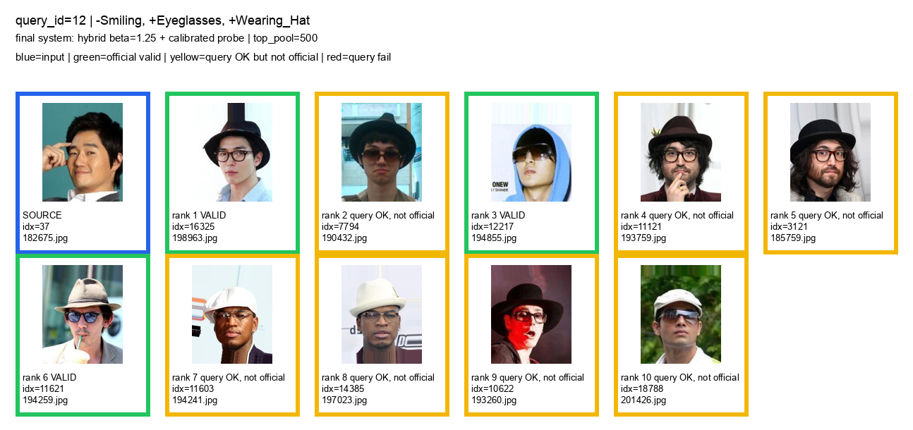
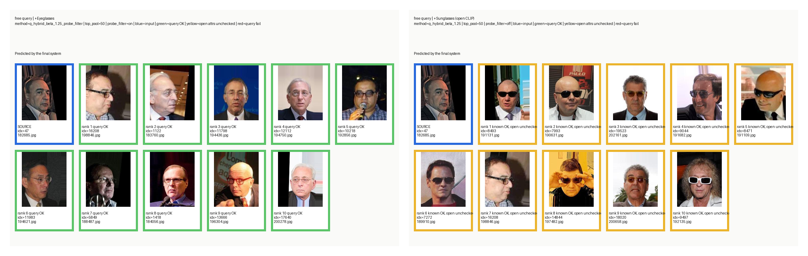
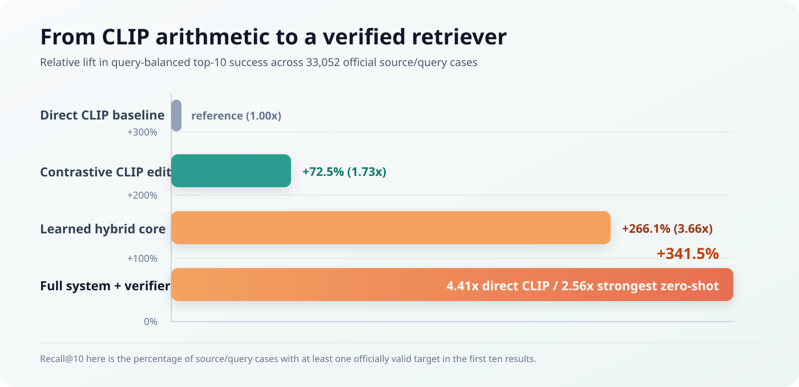
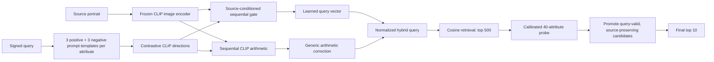
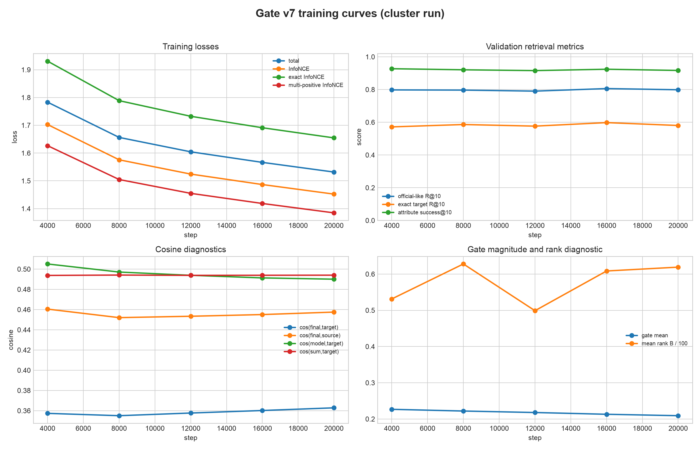
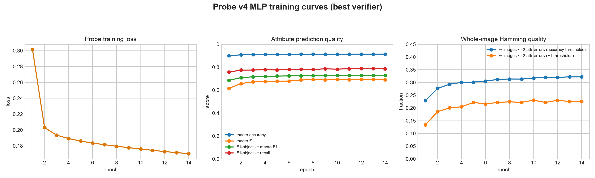

<h1 align="center">Hybrid Compositional Image Retrieval</h1>


<p align="center">
  
  
  
  
  
</p>

## What It Does

### Compositional Retrieval

**Query:** `-Smiling, +Eyeglasses, +Wearing_Hat`

Starting from the blue-bordered source portrait, the system searches the CelebA gallery for images that satisfy all three requested edits while preserving the source's remaining characteristics. The grid contains only the source and the final system's ranked top-10 results; it does not append a separate reference-target list.

<p align="center">
  
</p>

### Eyeglasses and Sunglasses Are Different Requests

The same source image is used in both panels. `+Eyeglasses` retrieves ordinary prescription glasses; `+Sunglasses` shifts the results toward dark or tinted eyewear. Sunglasses are not one of CelebA's 40 annotated attributes, so the right-hand result is a qualitative open-vocabulary demonstration rather than an official metric.

<p align="center">
  
</p>

## How It Works

CelebA provides identity labels and 40 binary attributes, but it does not provide explicit training triples of the form “source image + edit = target image”. We therefore constructed directional supervision from two photos, `A` and `B`, of the same identity: their attribute difference becomes the signed query, `A` is the source, and `B` is the desired retrieval target. This teaches the model to preserve person-specific information while applying the requested change. Because the benchmark also accepts source-compatible targets of different identities, later experiments progressively introduced train-split official-like multi-positive pairs and weak/global-attribute pairs. The selected training mixture uses 70% official-like pairs, 20% same-identity pairs, and 10% weak/global pairs. Frozen CLIP ViT-B/32 embeddings feed a source-conditioned sequential gate; its learned query is combined with a contrastive CLIP arithmetic correction, then a calibrated 40-attribute probe reranks the top-500 candidates.

## Prompt Arithmetic: From Addition to Signed Directions

We first treated a query as simple CLIP arithmetic. For a source embedding `z` and the edit `+Eyeglasses, -Smiling`, the progression was:

```text
direct addition:       q = normalize(z + t(Eyeglasses) - t(Smiling))
contrastive direction: d(a) = normalize(t_pos(a) - t_neg(a))
sequential update:     q0 = z
                       q1 = normalize(q0 + d(Eyeglasses))
                       q2 = normalize(q1 - d(Smiling))
```

Here, `t` is a single text embedding, while `t_pos` and `t_neg` are positive and negative prompt ensembles for the same attribute. This makes absence as explicit as presence. Contrastive sequential composition was the strongest zero-shot variant, improving macro Recall@10 from 10.8% for direct addition to 18.7%; it became the deterministic correction used by the final hybrid system.

## Motivation: Improving CLIP's Compositional Control

The goal is not to replace CLIP, but to improve its control when several edits must be applied while source context is preserved. CLIP supplies strong broad visual-semantic representations, yet prior work has documented weaknesses in compositional image-text reasoning, attribute binding, and reliance on correlated concepts: the original [CLIP paper](https://arxiv.org/abs/2103.00020), [Winoground](https://arxiv.org/abs/2204.03162), and [Concept Association Bias](https://arxiv.org/abs/2212.12043) motivate this setting. The method retains CLIP's open-vocabulary semantic directions, then adds source-conditioned composition and candidate verification where plain vector arithmetic is too coarse.

## Results At A Glance

Give the system a portrait and a signed natural-language edit such as:

```text
+Eyeglasses, -Smiling, +Wearing_Hat
```

It searches a gallery of real images for people who satisfy the requested changes while preserving the source's other annotated attributes. It does not generate pixels. It learns how to navigate CLIP's embedding space and how to rank existing images.

| Metric | Improvement |
| --- | ---: |
| Final system vs. the assignment's direct CLIP arithmetic baseline | **+341.5%** (`4.41x`) |
| Final system vs. our strongest zero-shot CLIP composition | **+155.9%** (`2.56x`) |
| Top-10 success rate, direct CLIP -> final system | **10.8% -> 47.9%** |
| Absolute gain over direct CLIP | **+37.0 percentage points** |

Here, **top-10 success** means that at least one officially valid target appears among the first ten retrieved images. The result is averaged equally across the 14 benchmark query types, so a frequent easy query cannot dominate the score.

<p align="center">
  
</p>

## The Problem

Standard image retrieval finds images similar to a source. Compositional retrieval is harder: the result must be similar in the right ways and different in exactly the requested ways.

For a source portrait and `+Eyeglasses, -Smiling`, a valid result must:

- wear eyeglasses;
- not smile;
- remain close to the source across attributes that were not requested;
- rank ahead of thousands of plausible but invalid CLIP neighbors.

The official CelebA benchmark contains **19,962 test images**, **14 query templates**, and **33,052 source-query cases**. A target is accepted only when it satisfies every signed query attribute and differs by at most two non-query CelebA attributes from the source.

This exposes a practical limitation of plain CLIP arithmetic: semantic directions often move toward the right broad concept, but the nearest images can violate one requested attribute or change too many unrelated properties.

## The Solution

The final system is a two-stage hybrid pipeline.



### 1. Contrastive Prompt Directions

Each CelebA attribute uses three positive and three negative photo templates. Their CLIP text embeddings are averaged separately, then converted into one normalized direction:

```text
positive_mean = normalize(mean(CLIP_text(positive_templates)))
negative_mean = normalize(mean(CLIP_text(negative_templates)))
d_attribute   = normalize(positive_mean - negative_mean)
```

For a signed condition, the system uses `+d_attribute` or `-d_attribute`. This was substantially stronger than adding only a positive text embedding.

### 2. Learned Sequential Composer

The gate processes one requested edit at a time. At each step it sees:

```text
[current_query, edit_direction, current_query * edit_direction,
 abs(current_query - edit_direction)]
```

An MLP predicts how strongly that edit should be applied. The query is normalized after every edit, preserving CLIP's cosine geometry. A small residual branch then models interactions that fixed vector arithmetic cannot express.

### 3. Explicit Arithmetic Correction

The learned gate and deterministic CLIP arithmetic make complementary errors. The final composer keeps both:

```text
q_model  = learned_sequential_gate(source, signed_query)
q_sum    = contrastive_sequential_CLIP_arithmetic(source, signed_query)
q_hybrid = normalize(q_model + 1.25 * (q_sum - source))
```

The term `(q_sum - source)` is a displacement, not a second absolute target. It corrects the learned vector in the semantic direction estimated by CLIP before cosine retrieval.

### 4. Calibrated Attribute Reranking

The hybrid vector retrieves a broad top-500 neighborhood. A separately trained MLP predicts 40 CelebA attributes from each frozen 512-dimensional CLIP image embedding. Per-attribute validation thresholds replace a brittle global `0.5` threshold.

Candidates predicted to satisfy the query and remain within non-query Hamming distance `<= 2` are promoted. If fewer than ten pass, the remaining positions are filled using the original hybrid cosine order. This avoids pretending the probe is perfect while still using it where it is informative.

## Reading the Retrieval Grid

In the visualization:

- blue is the source image;
- light green is a returned image that satisfies the requested edit and source-preservation rule;
- yellow satisfies the requested attributes but exceeds the strict preservation rule;
- red fails at least one requested attribute.

The yellow cases are useful diagnostics: they can be visually convincing while changing too many source attributes that were not requested.

## Why This Is More Than A Larger Network

The main improvement came from changing the problem decomposition, not simply adding parameters:

1. improve text edits with contrastive prompt ensembles;
2. learn source-conditioned edit strengths;
3. retain a deterministic semantic correction;
4. retrieve a broad candidate region;
5. explicitly rerank for query satisfaction and source preservation.

An oracle filtering experiment supported this design. When perfect attribute knowledge was applied inside the model's top-500 neighborhood, top-10 success reached about **96.5%** and top-10 precision about **57.3%**. This showed that the hybrid composer was often reaching the correct semantic region; candidate selection inside that region was the remaining bottleneck. The learned probe is a fair, imperfect approximation of that oracle and produces the final `47.9%` result.

## Experimental Decision Trail

| Stage | Finding | Decision |
| --- | --- | --- |
| Direct CLIP sum | Simple text addition reached only 10.8% top-10 success | Keep as the assignment baseline |
| Contrastive directions | Positive-minus-negative prompts gave a large gain | Use signed contrastive directions |
| Sequential normalization | Re-normalizing after each edit was the strongest zero-shot composition | Preserve sequential updates in the learned model |
| Early residual gate | Learned local edits but struggled on global/correlated attributes | Add explicit CLIP directions and mixed supervision |
| Additive and sequential gates | Source-conditioned edit weights beat zero-shot arithmetic | Continue with the sequential gate |
| Official-like multi-positive pairs | Better matched the benchmark but weakened identity preservation alone | Mix official-like, same-identity, and weak/global pairs |
| Hamming-weighted v7 | Giving stronger weight to `Hamming <= 1` positives improved the hybrid core | Select the v7 checkpoint |
| Model plus sum correction | Gate and deterministic directions made complementary errors | Use the learned-plus-arithmetic hybrid with `beta=1.25` |
| Oracle top-500 study | Correct targets were often nearby but not in the first ten | Add a learned candidate-selection stage |
| Probe architecture sweep | Deep embedding MLP beat linear, residual, label-wise, transformer, graph, CNN, and fusion alternatives on the official objective | Use the calibrated v4 MLP probe |
| Adversarial and multitask trials | More complex objectives did not consistently beat the stable hybrid pipeline | Keep the simpler, empirically stronger final system |

## Training Strategy

The gate uses frozen CLIP embeddings and a mixture of supervision:

| Pair family | Share | Purpose |
| --- | ---: | --- |
| Official-like multi-positive | 70% | Learn targets that satisfy the edit and preserve non-query attributes |
| Same identity | 20% | Preserve person-specific visual information |
| Weak/global focused | 10% | Oversample difficult edits such as age, gender presentation, and face shape |

Official-like targets receive weight `1.0` for non-query Hamming distance `<= 1`, `0.75` for distance `2`, and `0` beyond the official boundary. The total gate objective combines exact contrastive retrieval, weighted multi-positive retrieval, target/source cosine regularization, and a triplet term.

The selected gate was trained with AdamW, batch size `256`, learning rate `5e-5`, weight decay `1e-4`, gradient clipping at `1.0`, and up to `20,000` optimization steps. The selected probe is a `512 -> 1536 -> 1024 -> 512 -> 40` GELU MLP trained with asymmetric multilabel loss, AdamW at `2e-4`, batch size `2048`, and per-attribute threshold calibration.

<p align="center">
  
  
</p>

## Evaluation, In Plain Language

The headline comparison uses query-balanced top-K success so that results are understandable outside the course benchmark.

| Method | Top-1 success | Top-5 success | Top-10 success | Valid images in top 10 |
| --- | ---: | ---: | ---: | ---: |
| Direct CLIP arithmetic | 2.4% | 7.2% | 10.8% | 1.5% |
| Strongest zero-shot CLIP arithmetic | 4.1% | 12.4% | 18.7% | 2.7% |
| Learned hybrid composer | 9.0% | 26.9% | 39.7% | 6.6% |
| **Full hybrid + calibrated reranker** | **12.3%** | **35.7%** | **47.9%** | **8.6%** |

- **Top-K success (`Recall@K` in the assignment):** the percentage of source-query cases for which at least one officially valid image appears in the first K results.
- **Valid images in top K (`Precision@K`):** the average fraction of the first K results that are officially valid.
- **Macro:** calculate per query template first, then average so every query type has equal influence.
- **Micro:** pool all 33,052 source-query cases, so frequent query types contribute more.

The full CSV outputs, per-query breakdowns, checkpoints, and experiment logs are under [`final_best_system/results/`](final_best_system/results/) and summarized in [`final_best_system/manifest.json`](final_best_system/manifest.json).

## Generalization Beyond The Evaluation Vocabulary

Because the composer retains frozen CLIP directions, it can qualitatively process concepts that are absent from CelebA's 40 labels, such as `+Sunglasses` or `-visible teeth`. The learned probe only validates known CelebA attributes, so open-vocabulary edits are intentionally reported as qualitative demonstrations rather than official quantitative claims.

## Technology Stack

| Area | Tools |
| --- | --- |
| Modeling | Python, PyTorch, frozen OpenAI CLIP ViT-B/32, torchvision |
| Data | CelebA attributes, identity labels, official evaluation JSON |
| Analysis | NumPy, pandas, Matplotlib, Pillow |
| Experimentation | Jupyter, Google Colab, Slurm, CUDA |
| Reproducibility | Git, Git LFS, CSV/JSON manifests, saved checkpoints |

---

# Technical Guide

## Repository Map

```text
.
|-- notebooks/
|   `-- DL26_Project_Final_Submission.ipynb   # final report and runnable pipeline
|-- final_best_system/
|   |-- code/                                 # inference, evaluation, and visualization
|   |-- configs/                              # prompt and model configurations
|   |-- data/                                 # evaluation metadata and embedding caches
|   |-- results/                              # official metrics and probe artifacts
|   |-- weights/                              # selected gate checkpoint
|   `-- manifest.json                         # canonical final-system metadata
|-- cluster/
|   |-- scripts/                              # core training and evaluation code
|   |-- experimental/                         # ablations and architecture sweeps
|   |-- configs/                              # hyperparameter-search configurations
|   `-- jobs/                                 # original Slurm jobs
|-- celeba/                                   # local annotations; raw images are not committed
|-- celeba_evaluation.json                    # official benchmark queries and targets
|-- llm-wiki/                                 # experiment history, findings, and decisions
`-- docs/assets/readme/                       # README visuals
```

The canonical entry points are the [final notebook](notebooks/DL26_Project_Final_Submission.ipynb) and the [`final_best_system/`](final_best_system/) package. The other notebooks and experimental scripts document the research path.

## Installation

```bash
git clone https://github.com/KubaD4/Deep_Learning-Compositional-Image-Retrieval.git
cd Deep_Learning-Compositional-Image-Retrieval

git lfs install
git lfs pull

python3 -m venv .venv
source .venv/bin/activate
pip install -r final_best_system/code/requirements.txt
```

The first CLIP run downloads `openai/clip-vit-base-patch32` from Hugging Face. Set `HF_TOKEN` for authenticated, faster downloads if desired.

## Required Data

Metric-only evaluation uses the packaged test embeddings, annotations, prompt cache, checkpoints, and official JSON. Rendering qualitative image grids additionally requires the aligned CelebA images.

Place raw images at:

```text
celeba/img_align_celeba/
```

or pass `--images-dir /path/to/img_align_celeba` to the visualization command. CelebA and CLIP remain subject to their respective licenses and usage terms; raw CelebA images are not committed to this repository.

## Fast Verification

Run a CPU-safe end-to-end smoke test:

```bash
bash final_best_system/code/run_current_best_smoke.sh
```

This loads the gate, arithmetic correction, selected probe, calibrated thresholds, and a small official query subset. The tiny smoke score is only a plumbing check, not the reported benchmark result.

## Full Official Evaluation

```bash
bash final_best_system/code/run_current_best_full_eval.sh
```

This evaluates all 14 official query templates and 33,052 source-query cases using the cached CLIP embeddings. Outputs include summary CSVs, per-query metrics, and progress logs.

## Visualize An Official Query

```bash
.venv/bin/python final_best_system/code/show_json_retrieval_example.py \
  --query-id 5 \
  --source-index 3 \
  --top-k 10
```

`source-index` is the PyTorch dataset index used by the official JSON, not the numeric portion of the image filename. The script resolves the correct test-split filename through the packaged index mapping.

## Run A Free Query

Known CelebA attribute:

```bash
.venv/bin/python final_best_system/code/show_json_retrieval_example.py \
  --free-source-index 47 \
  --free-query "+Eyeglasses" \
  --top-k 10 \
  --top-pool 50
```

Open-vocabulary CLIP concept:

```bash
.venv/bin/python final_best_system/code/show_json_retrieval_example.py \
  --free-source-index 47 \
  --free-query "+Sunglasses" \
  --top-k 10 \
  --top-pool 50
```

Mixed multi-attribute query:

```bash
.venv/bin/python final_best_system/code/show_json_retrieval_example.py \
  --free-source-index 66 \
  --free-query "-visible teeth +Eyeglasses" \
  --top-k 10 \
  --top-pool 50
```

Open-vocabulary conditions use frozen CLIP directions but cannot be scored against CelebA labels that do not exist. Treat those outputs as qualitative evidence only.

## Notebook Execution Modes

Open [`notebooks/DL26_Project_Final_Submission.ipynb`](notebooks/DL26_Project_Final_Submission.ipynb) in Jupyter or Google Colab. Its boolean switches support three practical modes:

| Mode | Purpose | Main behavior |
| --- | --- | --- |
| Review | Read the report and saved outputs | Heavy recomputation disabled |
| Smoke from scratch | Verify embedding, pair, gate, probe, and inference code | Small split limits and short training enabled |
| Full reproduction | Rebuild complete embeddings, pairs, training, and evaluation | Full split, GPU, and heavy flags enabled |

The full mode requires the raw CelebA dataset and substantial GPU time. The notebook explains each switch next to its configuration cell and leaves the original cluster curves and official outputs visible for review.

## Reproduce Training On Slurm

The original selected gate and probe jobs are:

```text
cluster/jobs/54_hamming_weighted_v7_3h.sh
cluster/jobs/65_probe_arch_sweep_v4_finetune_long.sh
```

They preserve the exact research configuration but contain the UNITN cluster path and partition settings. Adapt the `cd`, partition, time, memory, and GPU directives before submitting on another cluster.

Typical submission pattern:

```bash
sbatch cluster/jobs/54_hamming_weighted_v7_3h.sh
sbatch cluster/jobs/65_probe_arch_sweep_v4_finetune_long.sh
```

## Key Artifacts

| Artifact | Path |
| --- | --- |
| Gate checkpoint | `final_best_system/weights/best_val_official_like_at10.pt` |
| Probe checkpoint | `final_best_system/results/probe_embedding_v4_m04/probe/best_probe.pt` |
| Calibrated thresholds | `final_best_system/results/probe_embedding_v4_m04/probe/calibrated_thresholds.pt` |
| Prompt directions | `final_best_system/data/celeba/embeddings/openai_clip_vit_b32/signed_attribute_prompt_embeddings_v2_photo_templates.pt` |
| Test image embeddings | `final_best_system/data/celeba/embeddings/openai_clip_vit_b32/test_image_embeddings.pt` |
| Official evaluation JSON | `final_best_system/data/celeba_evaluation.json` |
| Canonical system metadata | `final_best_system/manifest.json` |

If the v4 probe package is absent, the runner reports the fallback explicitly and uses the older packaged calibrated probe. For the result reported above, ensure the v4 checkpoint and thresholds are present after `git lfs pull` or artifact transfer.

## Reproducibility Notes

- CLIP remains frozen; the project trains the composer and attribute probe from scratch on cached CLIP embeddings.
- CelebA's official train, validation, and test partitions are respected.
- The official JSON test targets are used for final evaluation, not as gate/probe training labels.
- Validation data calibrates checkpoints and per-attribute probe thresholds.
- Every reported method stores aggregate and per-query CSVs so the tables can be regenerated without trusting notebook prose.
- Random seeds, model configuration, paths, and selected checkpoints are recorded in run directories and manifests.

## Authors

- Di Quattro Kuba
- Giacomo Vettore
- Danilo Frailis

Developed for the **Deep Learning 2025/2026** course at the University of Trento.
