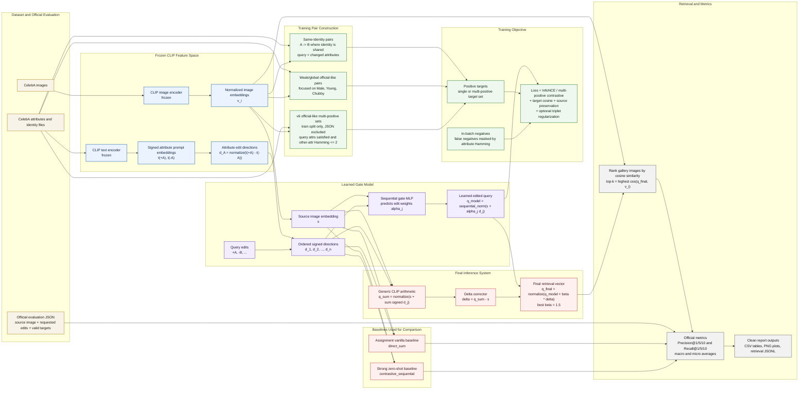

# Final System Architecture Diagram

This diagram summarizes the current final-best system:

- frozen CLIP image/text encoders are used to build image embeddings and signed attribute directions;
- a learned sequential gate predicts how strongly to apply each requested edit;
- a generic CLIP arithmetic displacement is used as a correction term;
- final retrieval ranks gallery images by cosine similarity against the final query vector;
- evaluation follows the official JSON with Precision@K and Recall@K.

