# CLIP Data Flow: Images, Tensors, Embeddings, and Retrieval

## Central Point

CLIP contains two different encoders:

- a vision encoder for images;
- a text encoder for token sequences.

Their internal hidden representations are different, but CLIP applies learned projection layers that map both modalities into a shared final embedding space. For `openai/clip-vit-base-patch32`, the final projected vectors normally have dimension 512.

Only these projected features should be mixed or compared directly:

```text
image -> vision encoder -> vision projection -> z_image in R^512
text  -> text encoder   -> text projection   -> z_text  in R^512
```

After L2 normalization, cosine similarity is simply their dot product.

## Image Conversion

An image exists in several forms during the pipeline:

```text
JPEG file
  -> PIL image / decoded RGB pixels
  -> CLIP preprocessing
  -> pixel_values tensor [B, 3, 224, 224]
  -> CLIP vision encoder and projection
  -> image embedding [B, 512]
  -> L2 normalization
  -> unit image embedding [B, 512]
```

Example pseudocode:

```python
inputs = processor(images=pil_images, return_tensors="pt")
pixel_values = inputs["pixel_values"]       # [B, 3, 224, 224]
z_image = model.get_image_features(pixel_values=pixel_values)  # [B, 512]
z_image = normalize(z_image, dim=-1)
```

The processor resizes, crops, converts RGB values to floating point, and normalizes the channels using CLIP's expected statistics.

## Text Conversion

A textual condition also passes through several forms:

```text
Python string
  -> CLIP tokenizer
  -> input_ids and attention_mask [B, 77]
  -> CLIP text encoder and projection
  -> text embedding [B, 512]
  -> L2 normalization
  -> unit text embedding [B, 512]
```

Example pseudocode:

```python
prompts = ["a face wearing eyeglasses"]
inputs = processor(text=prompts, return_tensors="pt", padding=True)
z_text = model.get_text_features(
    input_ids=inputs["input_ids"],
    attention_mask=inputs["attention_mask"],
)                                               # [B, 512]
z_text = normalize(z_text, dim=-1)
```

The raw benchmark string `+Eyeglasses` should generally be converted into natural language such as `"a face wearing eyeglasses"`. A negative condition can use a prompt such as `"a face without eyeglasses"`. Prompt templates should be treated as an experimental choice.

## Why Image And Text Embeddings Are Comparable

An image encoder and text encoder naturally produce different internal features. CLIP was trained contrastively on image-caption pairs so that, after their final projection layers:

- a matching image and caption have high cosine similarity;
- a mismatching image and caption have lower similarity.

Illustrative three-dimensional example:

```text
image of a dog       -> [0.80, 0.55, 0.10]
text "a dog"         -> [0.77, 0.59, 0.08]  high cosine similarity
text "an airplane"  -> [0.05, 0.18, 0.98]  low cosine similarity
```

The coordinates have no individually named meaning. The example only illustrates that semantically aligned inputs should point in similar directions.

## Interpreting Attribute Presence

Absolute image-text cosine values are not calibrated probabilities and are
often compressed into a narrow positive range. For one attribute, compare a
positive and a semantically opposed prompt:

```text
s_pos  = cosine(z_image, t_pos)
s_neg  = cosine(z_image, t_neg)
margin = s_pos - s_neg
d      = normalize(t_pos - t_neg)
score  = cosine(z_image, d)
```

The margin and direction score have the same sign. The direction score is the
margin divided by `||t_pos - t_neg||`. A positive value means CLIP prefers the
positive prompt relative to the supplied negative prompt; it does not prove the
attribute is present.

Repeated positive/negative prompt pairs can be averaged into positive and
negative prototypes. This reduces dependence on one wording and exposes prompt
disagreement through the mean and standard deviation of pair margins. Local
experiments showed strong prompt sensitivity: `Wearing_Hat` worked with lexical
opposites, while `Smiling` was inconclusive and `Mustache` was incorrect for the
same labeled image. See
[Cluster Baselines and Prompt Experiments](cluster-baselines-and-prompt-experiments.md).

This shared space is useful but imperfect. Attribute binding, negation, fine facial identity, and vector arithmetic are not guaranteed to behave cleanly. That limitation motivates the learned composition network.

## What A Training Example Stores

Conceptually, one example is:

```text
(source image, signed textual conditions, target image)
```

In an efficient implementation, the dataset can store only lightweight references:

```text
source_index
target_index
conditions = [("Eyeglasses", +1), ("Smiling", +1)]
```

Because CLIP is frozen, the training loop can use cached embeddings:

```text
z_source: Tensor[512]
c_1:      Tensor[512]
c_2:      Tensor[512]
z_target: Tensor[512]
```

`z_target` is supervision. It is not passed into the composition network as an input.

If embeddings are not cached, source and target JPEG images are loaded and converted to pixel tensors before being passed through frozen CLIP. The mathematical training example is unchanged.

## Recommended Composition Network

For a single condition:

```text
input:  concat(z_source, c_text) in R^1024
MLP:    1024 -> 1024 -> 512
output: Delta_z in R^512
query:  q = normalize(z_source + Delta_z)
```

Example with artificial three-dimensional vectors:

```text
z_source = [0.80, 0.10, 0.30]
c_text   = [0.05, 0.90, 0.20]

NN([z_source, c_text]) = Delta_z = [-0.10, +0.50, +0.10]

z_source + Delta_z = [0.70, 0.60, 0.40]
q = normalize([0.70, 0.60, 0.40])
```

Suppose the target embedding is approximately:

```text
z_target = normalize([0.72, 0.58, 0.39])
```

Training encourages `q` and `z_target` to have high cosine similarity.

The network output is therefore a vector of length 512, not a single number. Calling this pure regression is incomplete: it predicts a continuous vector, but the recommended objective is contrastive ranking loss because the final task is retrieval.

## Multiple Conditions

For conditions `c_1, ..., c_m`, use a small learned gate or attention block:

```text
alpha_j = softmax(score(z_source, c_j))
c_fused = sum_j alpha_j * c_j
Delta_z = MLP(concat(z_source, c_fused))
q       = normalize(z_source + Delta_z)
```

Positive and negative conditions should retain their sign through distinct natural-language prompts, sign embeddings, or separate positive/negative branches. Simply multiplying a text vector by `-1` is a baseline, not a guaranteed semantic representation of negation.

## Training Phase

For batch size `B`:

```text
z_source: [B, 512]
conditions: [B, M, 512]
z_target: [B, 512]

q = composition_network(z_source, conditions)  # [B, 512]
S = q @ z_target.T / temperature                # [B, B]
loss = cross_entropy(S, arange(B))
```

Only the composition network is updated. Frozen CLIP embeddings act as the coordinate system.

## Validation And Test

Validation uses the same forward pass as training, but without gradient updates. Ground-truth targets are used only to compute metrics and choose hyperparameters.

Official test evaluation:

```text
source index + JSON query
  -> source embedding and text embeddings
  -> q [512]
  -> similarity against gallery matrix G [19962, 512]
  -> scores = G @ q [19962]
  -> top-K dataset indices
  -> compare with celeba_evaluation.json
```

The target image is never supplied to the model during validation, test, or real inference.

## Which Embeddings To Precompute

If CLIP remains frozen, precompute image embeddings once:

- train images for tuple training;
- validation images for model selection;
- all 19,962 test images for the retrieval gallery.

Precompute the finite set of prompt embeddings as well. If prompt wording is changed during experiments, recompute only the text cache.

For 202,599 images and 512 dimensions, the complete image cache is approximately:

- 396 MiB in float32;
- 198 MiB in float16.

The test gallery alone is approximately 39 MiB in float32 or 20 MiB in float16.

## Full Flow

```mermaid
flowchart LR
    A["CelebA JPEG source"] --> B["CLIP processor"]
    B --> C["pixel_values Bx3x224x224"]
    C --> D["Frozen CLIP vision encoder"]
    D --> E["z_source Bx512"]

    F["Signed query +Eyeglasses"] --> G["Prompt template"]
    G --> H["CLIP tokenizer"]
    H --> I["input_ids / attention_mask"]
    I --> J["Frozen CLIP text encoder"]
    J --> K["condition embeddings BxMx512"]

    E --> L["Gating / attention + residual MLP"]
    K --> L
    L --> M["Delta_z Bx512"]
    E --> N["Add and L2 normalize"]
    M --> N
    N --> O["query embedding q Bx512"]

    P["CelebA JPEG target, training only"] --> Q["Frozen CLIP vision encoder"]
    Q --> R["z_target Bx512"]
    O --> S["Contrastive loss during training"]
    R --> S

    T["Cached gallery G Nx512"] --> U["Cosine scores G @ q"]
    O --> U
    U --> V["Top-K dataset indices"]
    V --> W["Recall@K / Precision@K against JSON"]
```


